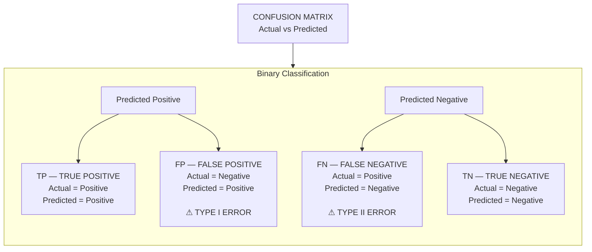

# All About Hypothesis testing

### 1. What is Hypothesis Testing?  
Hypothesis Testing is a statistical method used to decide whether a claim about a population is supported by sample data.  

Simple flow:   
```   
Population
    ↓
Take Sample
    ↓
Calculate Statistic
    ↓
Test H₀ vs H₁
    ↓
p-value / Critical Value
    ↓
Statistical Decision
    ↓
Business / Scientific Conclusion 
```   

**Simple Example**   

Suppose a company claims:  

"Our new website has a 10% conversion rate." 

We collect sample data and test whether the actual conversion rate is really 10%.   

### 2. Two Hypotheses   
Every hypothesis test mainly starts with two statements. 

**H₀ — Null Hypothesis**   

H₀ represents the **default assumption** or **no significant change/effect.** 

Example: 

```
H₀: μ = 50  
```   

Meaning: Population mean is 50.  

**H₁ / Hₐ — Alternative Hypothesis**   

H₁ represents what we are tryping to find evidence for.  

```   
H₁: μ ≠ 50  
```   

Meaning: Population mean is different from 50.

Hypothesis testing is a form of statistical inference that uses data from a sample to draw conclusions about a population parameter or a population probability distribution

Hypothesis testing is an act in statistics whereby an analyst tests an assumption regarding a population parameter. the Methodology employed by the analyst depends on the nature of the data used and the reason for the analysis. 

```
Sample data -----> Population data
              |
              |
              V
          conclusion  --> by hypothesis Testing.    
```

Hypothesis Testing --> Coin is fair or not? 

1. Null Hypothesis(H₀) => Coin is fair  
2. Alternate Hypothesis (H1​]) => Coin is not fair
3. Experiment performs whether the Null Hypothesis accepted or not?

Example of Experiment Tossing Coin for 100 times?   

``` 
                     Experiment: Tossing a Coin 100 Times

                              Sampling Distribution
                                     
                                      ╭──────╮
                                  ╭───╯      ╰───╮
                               ╭──╯              ╰──╮
                            ╭──╯                    ╰──╮
                         ╭─╯                            ╰─╮
                      ╭─╯                                  ╰─╮
                   ╭─╯                                        ╰─╮
──────────────────┼──────────┼──────────┼──────────┼──────────┼──────────┼──────────
                 10         30         40         50         60         70         90
                            │←──────────────────────────────--------→   │
                            │                                           │
                           30                                           70
                                                 ↑
                                               Mean
                                                50
``` 

if the No's of coins in Heads lie's in between 30 to 70 times region then our coin is fair Null Hypothesis we considersAccepting but it outside present then we considers as they are not fair or Alternate Hypothesis or rejectes Null Hypothesis testing or 30 to 70 intervals are **Confidence Intervals** as they we let considers ourselfs but they can decides by the Domain Experts or Confidence Intervals we decided as here in numbers but we also decideds into percentage like 95% that time our curve is more wider to the base line or the main region is considers as the 95% or ends points of both sides considers as the lefted our 100% 5% both sides 2.5% in each sides and knows as the **significane values**.    

``` 
                         95% Confidence Level
                              Two-Tailed Test

                                  ╭───╮
                               ╭──╯   ╰──╮
                            ╭─╯           ╰─╮
                         ╭─╯                 ╰─╮
                      ╭─╯                       ╰─╮
                   ╭─╯                             ╰─╮
                ╭─╯                                   ╰─╮
───────────────╯                                         ╰───────────────
       │                         │                         │
     2.5%                       95%                       2.5%
       │                         │                         │
       │                    Accepted Region                │
       │                                                   │
   Lower Critical                                     Higher Critical
      Region                                               Region
       │                                                   │
     -2 SD                                               +2 SD  
```

### 3. p-Value 

The **p-value** tells us how unusual our observed result would be if **H₀ were actually true.** 

**Decision Rule** 

```   
p-value ≤ α
        ↓
Reject H₀   
```   

```   
p-value > α
        ↓
Fail to Reject H₀ 
```   

For the common case α = 0.05: 

| p-value | Decision          |
| ------- | ----------------- |
| ≤ 0.05  | Reject H₀         |
| > 0.05  | Fail to Reject H₀ |

**Example** 

```   
p = 0.02
α = 0.05 
```   

Since 

```   
0.02 < 0.05 
```   

→ Reject H₀ 

There is statistically significant evidance against H₀.  

### 4. Test Statistic   

A test statistics measures how far our sample result is from what H₀ expects. 

General idea:  

```   
Test Statistic =
Observed Result − Expected Result
----------------------------------
        Standard Error  
```   

Different tests use different statistics: 

```   
Z-test       → Z statistic
T-test       → t statistic
Chi-Square   → χ² statistic
F-test       → F statistic
ANOVA        → F statistic 
```   

### 5. One-Tailed vs Two-Tailed Test   

This depends on the Alternative Hypothesis.  

**Two-Tailed** 

Used when we only care whether something is **different.**  

```   
H₁: μ ≠ 50  
```   

Both directions matter:    
```   
Too Low ←────────→ Too High   
```   

**Right-Tailed**  

Used When we want to know whether something is **greater.** 

```   
H₁: μ > 50  
```   

**Left-Tailed**   

Used when we want to know whether something is **smaller.** 

```   
H₁: μ < 50  
```   

Quick Rule  

```   
≠  → Two-tailed
>  → Right-tailed
<  → Left-tailed  
```   

### 6. Critical Value   

A Critical value is the boundary between: 

```   
Normal / Expected Region
        ↓
Critical / Extreme Region  
```   

For example, in a standard Normal two-tailed test with α = 0.05:  

```   
Critical values ≈ -1.96 and +1.96   
```

Decision: 

```   
Z < -1.96  → Reject H₀
Z > +1.96  → Reject H₀
Otherwise  → Fail to Reject H₀   
```

### 7. Type 1 and Type 2 Errors  

These are extremely important 

| Reality  | Our Decision   | Result            |
| -------- | -------------- | ----------------- |
| H₀ true  | Reject H₀      | **Type I Error**  |
| H₀ true  | Fail to Reject | Correct           |
| H₀ false | Reject H₀      | Correct           |
| H₀ false | Fail to Reject | **Type II Error** |


**Type 1 Error**  

```   
Reject a true H₀  
```   

Also Called: **False Positive**  

Probability: ```P(Type I Error) = α``` 

**Type 2 Error**  

```   
Fail to reject a false H₀  
```   

ALso Called: **False Negative**

Probability: ```P(Type II Error) = β```

**Statistical Power**   

Power is the probability of correctly detecting a real effect. 

```   
Power = 1 − β  
```   

Higher power generally means a better chance of detecting a real effect.

**ConFusion Metrix** 



Reality : Null Hypothesis is True or Null Hypothesis is false. 

Decision : Null Hypothesis is True or Null Hypothesis is false.   

Outcome 1 : We reject the Null Hypothesis --> In reality it is false so in confusion metrix is the case of True Negative so it is Correct Classification.   

Outcome 2 : We fail to reject the NUll Hypothesis or we retain the Null Hypothesis --> In Reality it is true means we cannot reject the null hypothesis because is true to outcomes true indicates is the case of True Positive in confusion metrix.  

Outcome 3 : We reject the NUll Hypothesis --> but in reality Null Hypothesis we cannot reject it outcomes gives true of null hypothesis but we can test by hypothesis testing reject of Null hypothesis so this case is False Positive in Confusion metrix it's wrong prediction or miss classification is called as **Type 1 Error.** 

Example of Outcome 3 : H0(Reality) : the IQ of Class is 100 but H1(Test out selfs) : The IQ of class is not 100 this is **type 1 Error.**

Outcome 4 : We fail to reject the NUll Hypothesis --> In Reality it is False it is konws in confusion metrix is false negative it is called as the **Type 2 Error.** 

### 8. Confidence Interval 

A **Confidence Interval (CI)** gives a range of plausible values for an unknown population parameter. 

Instead of saying:   

```   
Mean = 50   
```   

we may say: 

```   
95% CI = [47, 53] 
```   

Meaning : Based on the sample and method used, the interval gives a range of plausible population values.   

*Confidence Level**  

Common Confidence Levels:  

```   
90%
95%
99%   
```   

Higher confidence means a wider interval. 

```   
90% → Narrower
95% → Wider
99% → Widest   
```   

There is a trade-off:   

```      
Higher Confidence
       ↓
Wider Interval
       ↓
More uncertainty covered   
```   

### 9. Confidence Interval Formula  

For a population mean when σ is unknown:  

$$
CI = \bar{x} \pm t^* \frac{s}{\sqrt{n}}
$$ 

Where:   

- $\bar{x}$ = Sample mean
- $t^*$ = Critical t-value
- $s$ = Sample standard deviation
- $n$ = Sample size  

**Margin of Error**  

$$
ME = t^* \frac{s}{\sqrt{n}}
$$ 

Therefore:  

$$
CI = \bar{x} \pm ME
$$


### 10. Connection: CI and Hypothesis Testing   

confidence intervals and hypothesis testing are closely connected.   

for a **two-sided test** at:  

```   
α = 0.05 
```   

we commonly use a:   

```   
95% Confidence Interval 
```   

If the hypothesized value is **outside** the 95% CI:  

→ Reject H₀.   

If it is **inside** the CI:   

→ Fail to Reject H₀.

**Example** 

Suppose: 

```   
H₀: μ = 50
95% CI = [52, 58] 
```

50 is outside the interval.   

→ Evidence against H₀
→ Reject H₀

``` 
1. Understand the business question
            ↓
2. Identify population and sample
            ↓
3. Identify variable type
            ↓
4. Define H₀
            ↓
5. Define H₁
            ↓
6. Decide one-tail / two-tail
            ↓
7. Select correct statistical test
            ↓
8. Check assumptions
            ↓
9. Calculate test statistic
            ↓
10. Calculate p-value / critical value
            ↓
11. Compare with α
            ↓
12. Reject / Fail to Reject H₀
            ↓
13. Calculate CI / effect size when useful
            ↓
14. Convert statistical result into business meaning    
``` 

``` 
H₀
↓
Default / No Effect

H₁
↓
Effect / Difference / Relationship

α
↓
Allowed Type-I Error

p-value
↓
Strength of evidence against H₀

p ≤ α
↓
Reject H₀

p > α
↓
Fail to Reject H₀   
``` 

``` 
Mean?
 ↓
Large sample / σ known → Z-Test
Small sample / σ unknown → T-Test

Categorical?
 ↓
Chi-Square

3+ Means?
 ↓
ANOVA

Variances?
 ↓
F-Test  
``` 

**Confidence Interval**

```
Estimate
   ±
Margin of Error
   =
Confidence Interval 
``` 


### Hypothesis Testing — Complete Quick Notes

Hypothesis Testing is a statistical method used to decide whether a result found in sample data is strong enough to make a conclusion about the population.

It helps answer questions like:

- Is the average really different?
- Are two groups different?
- Are two categorical variables related?
- Are three or more groups different?
- Are two variances different?

---

# 1. Z-Test

## Purpose

Z-Test is mainly used to compare a sample mean with a known population mean.

### Use When

- Sample size is usually large.
- Population Standard Deviation (`σ`) is known.
- Data is approximately normal or sample size is large enough.

### Hypotheses

```text
H₀: μ = μ₀
H₁: μ ≠ μ₀
````

### Formula


```
Z = (x̄ - μ₀) / (σ / √n)
```

Where:

- `x̄` = Sample Mean 
- `μ₀` = Hypothesized Population Mean 
- `σ` = Population Standard Deviation 
- `n` = Sample Size 

### Decision


```
p-value < α
→ Reject H₀

p-value ≥ α
→ Fail to Reject H₀
```

### Example

A company claims that the average delivery time is 30 minutes.

We collect a large sample and test:

> Is the actual average delivery time different from 30 minutes?

### Key Point

Z-Test is mainly useful when the **population standard deviation is known**.

---

# 2. T-Test

T-Test is used when the **population standard deviation is unknown**.

It is especially useful for small samples.

There are three important types:

---

## 2.1 One-Sample T-Test

### Purpose

Compare one sample mean with a known or hypothesized value.

### Example

Expected average salary:


```
$50,000
```

Sample average:

-

```
$53,000
```

Question:

> Is the actual average salary significantly different from $50,000?

### Formula

-

```
t = (x̄ - μ₀) / (s / √n)
```

Where:

- `x̄` = Sample Mean 
- `μ₀` = Hypothesized Mean 
- `s` = Sample Standard Deviation 
- `n` = Sample Size 

### Degrees of Freedom

-

```
df = n - 1
```

---

## 2.2 Independent Two-Sample T-Test

### Purpose

Compare the means of **two independent groups**.

### Example

-

```
Group A → Average Salary
Group B → Average Salary
```

Question:

> Is the average salary significantly different between the two groups?

### Examples

-  Male vs Female salary 
-  Old model vs New model performance 
-  Control group vs Treatment group 

### Important

The observations in the two groups should be independent.

---

## 2.3 Paired T-Test

### Purpose

Compare two measurements from the **same subjects or items**.

### Example

-

```
Employee Performance

Before Training
        vs
After Training
```

The same employees are measured twice.

### Other Examples

-  Before vs After treatment 
-  Before vs After training 
-  Model performance before vs after improvement 

### Main Difference

-

```
Independent T-Test
→ Different subjects/groups

Paired T-Test
→ Same subjects measured twice
```

---

# 3. Chi-Square Test

Chi-Square Test is mainly used for **categorical data**.

It works with frequencies or counts rather than comparing numerical means.

There are two important types.

---

## 3.1 Chi-Square Goodness of Fit

### Purpose

Checks whether observed category frequencies match an expected distribution.

### Example

A company expects:

-

```
Product A → 40%
Product B → 35%
Product C → 25%
```

We collect actual sales and check:

> Do the observed sales follow the expected distribution?

### Hypotheses

-

```
H₀ → Observed distribution matches expected distribution.

H₁ → Observed distribution is different from expected distribution.
```

---

## 3.2 Chi-Square Test of Independence

### Purpose

Checks whether **two categorical variables are related**.

### Example

-

```
Gender × Product Purchase
```

Question:

> Is product purchase related to gender?

### Other Examples

-  Education × Job Status 
-  Device Type × Purchase 
-  Region × Product Preference 

### Hypotheses

-

```
H₀ → Variables are independent.

H₁ → Variables are associated.
```

### Formula


```
χ² = Σ((O - E)² / E)
```

Where:

- `O` = Observed Frequency 
- `E` = Expected Frequency 

### Important Assumption

Expected frequencies should generally be large enough, commonly around `5` or more per cell.

---

# 4. ANOVA

## Purpose

ANOVA is used to compare the means of **three or more groups**.

### Example

Compare average sales from:

-

```
Region A
Region B
Region C
Region D
```

Question:

> Is at least one group mean significantly different?

### Hypotheses

-

```
H₀ → All group means are equal.

H₁ → At least one group mean is different.
```

### Main Concept

ANOVA uses an **F-statistic**.

It compares:

-

```
Between-Group Variation
            /
Within-Group Variation
```

Large F-value:

-

```
Large Between-Group Variation
relative to
Within-Group Variation
```

This gives stronger evidence that the group means are different.

### Important

ANOVA tells us:

> At least one group is different.

It does **not** directly tell us which group is different.

To find the specific groups, use a **post-hoc test** such as Tukey's HSD.

### Examples

-  Compare 3+ marketing campaigns 
-  Compare average sales across regions 
-  Compare treatment groups 
-  Compare model performance across multiple datasets 

---

# 5. F-Test

## Purpose

F-Test is mainly used to compare **variances**.

It checks whether two populations have significantly different variances.

### Example

-

```
Process A → Variance
Process B → Variance
```

Question:

> Is the variability of Process A significantly different from Process B?

### Formula

-

```
F = s₁² / s₂²
```

Where:

- `s₁²` = Variance of Group 1 
- `s₂²` = Variance of Group 2 

### Important Connection

The F-distribution is also used in:

-  ANOVA 
-  Regression significance testing 
-  Variance analysis 

### Practical Note

The classical F-Test is sensitive to non-normal data.

For real-world non-normal data, more robust variance tests may be better.

---

# 6. Confidence Intervals

## Purpose

A Confidence Interval gives a **range of plausible values** for a population parameter.

Instead of saying:

-

```
Mean = 50
```

we can say:

-

```
95% CI = [47, 53]
```

This gives information about the uncertainty around the estimate.

---

## General Structure

-

```
Estimate ± Margin of Error
```

### Mean with Known Population Standard Deviation

-

```
CI = x̄ ± z* × (σ / √n)
```

### Mean with Unknown Population Standard Deviation

-

```
CI = x̄ ± t* × (s / √n)
```

---

## Common Confidence Levels

-

```
90%
95%
99%
```

Higher confidence:

-

```
→ Wider interval
```

Lower confidence:

-

```
→ Narrower interval
```

---

## Confidence Interval and Hypothesis Testing

For a two-sided test:

-

```
95% Confidence Level
        ↓
α = 0.05
```

If the hypothesized value is outside the 95% Confidence Interval:

-

```
→ Evidence against H₀
```

If it is inside:

-

```
→ Not enough evidence to reject H₀
```

---

# 7. Test Selection Guide

Choose the test based on:

-

```
Data Type
+
Number of Groups
+
Relationship
+
Research Question
```

| ProblemTest                                       |                                 |
| ------------------------------------------------- | ------------------------------- |
| One mean vs known value, population σ known       | Z-Test                          |
| One mean vs known value, population σ unknown     | One-Sample T-Test               |
| Two independent means                             | Independent T-Test              |
| Same subjects before and after                    | Paired T-Test                   |
| One categorical variable vs expected distribution | Chi-Square Goodness of Fit      |
| Relationship between two categorical variables    | Chi-Square Test of Independence |
| Three or more group means                         | ANOVA                           |
| Compare two variances                             | F-Test                          |
| Estimate a population parameter                   | Confidence Interval             |

---

# 8. Quick Test Selection

-

```
What type of data do I have?
          │
          ├── Continuous Data
          │       │
          │       ├── Compare 1 Mean
          │       │       │
          │       │       ├── σ Known
          │       │       │      ↓
          │       │       │    Z-Test
          │       │       │
          │       │       └── σ Unknown
          │       │              ↓
          │       │        One-Sample T-Test
          │       │
          │       ├── Compare 2 Means
          │       │       │
          │       │       ├── Independent Groups
          │       │       │      ↓
          │       │       │  Independent T-Test
          │       │       │
          │       │       └── Same Subjects
          │       │              ↓
          │       │          Paired T-Test
          │       │
          │       └── Compare 3+ Means
          │              ↓
          │            ANOVA
          │
          ├── Categorical Data
          │       │
          │       ├── Observed vs Expected
          │       │      ↓
          │       │  Chi-Square Goodness of Fit
          │       │
          │       └── Relationship Between Categories
          │              ↓
          │        Chi-Square Independence
          │
          └── Compare Variances
                 ↓
               F-Test
```

---

# 9. General Hypothesis Testing Workflow

Most statistical tests follow this workflow:

-

```
1. Understand the Problem
        ↓
2. Identify the Data Type
        ↓
3. Define H₀ and H₁
        ↓
4. Choose the Correct Test
        ↓
5. Check Test Assumptions
        ↓
6. Calculate Test Statistic
        ↓
7. Calculate P-Value
        ↓
8. Compare P-Value with α
        ↓
9. Make Statistical Decision
        ↓
10. Calculate Confidence Interval
        ↓
11. Interpret the Result
        ↓
12. Connect Result with Business/Domain Context
```

---

# 10. Important Statistical Terms

## Significance Level (α)

The significance level is the threshold used to make the statistical decision.

Common value:

-

```
α = 0.05
```

This means we accept a 5% Type I error risk.

---

## P-Value

P-value tells us how unusual the observed result would be if the Null Hypothesis were true.

-

```
p-value < α
→ Reject H₀

p-value ≥ α
→ Fail to Reject H₀
```

Important:

> A p-value is not the probability that H₀ is true.

---

## Test Statistic

A test statistic measures how far the observed result is from what H₀ expects.

Examples:

-

```
Z-Test
→ Z

T-Test
→ t

Chi-Square Test
→ χ²

ANOVA
→ F

F-Test
→ F
```

---

# 11. Type I and Type II Errors

## Type I Error

Rejecting H₀ when H₀ is actually true.

-

```
False Positive
```

Probability:

-

```
α
```

---

## Type II Error

Failing to reject H₀ when H₀ is actually false.

-

```
False Negative
```

Probability:

-

```
β
```

---

## Statistical Power

Power is the ability of a test to detect a real effect.

-

```
Power = 1 - β
```

Higher power:

-

```
→ Better chance of detecting a real difference
```

Power can generally increase with:

-  Larger sample size 
-  Larger true effect 
-  Lower data variability 
-  Appropriate significance level 

---

# 12. Statistical vs Practical Significance

A result can be statistically significant but have very little real-world importance.

### Example

-

```
Old Model Accuracy = 99.00%

New Model Accuracy = 99.01%
```

With a very large dataset, this small difference may become statistically significant.

But the business impact may be very small.

Therefore, always consider:


```
Statistical Significance
        +
Effect Size
        +
Confidence Interval
        +
Business Context
```

---

# 13. Important Assumptions

Before applying any statistical test, check its assumptions.

Common assumptions include:

### Independence

Observations should be independent when the selected test requires it.

### Normality

Some tests assume the data or residuals are approximately normally distributed.

### Variance

Some tests assume similar variances between groups.

### Sample Size

Very small samples can make statistical conclusions less reliable.

### Categorical Frequency

For Chi-Square tests, expected frequencies should generally be sufficiently large.

> Always check assumptions before trusting the p-value.
